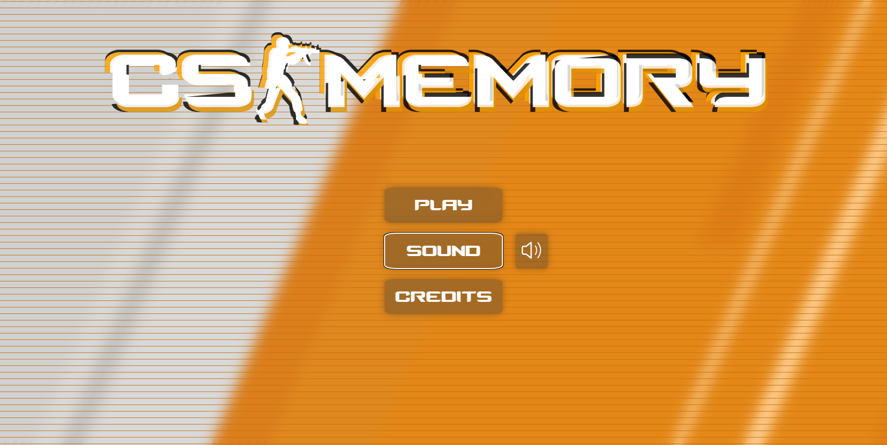
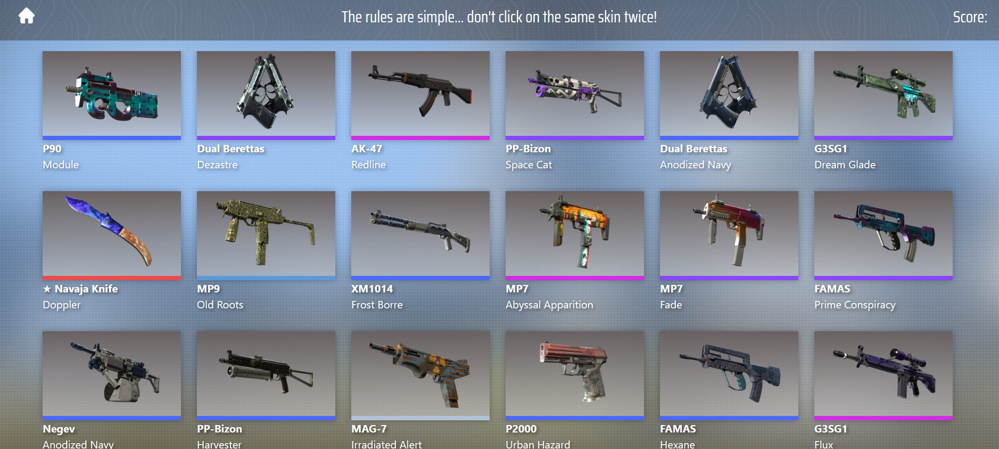

# CS-Memory

A Counter Strike 2 memory game for [The Odin Project](https://www.theodinproject.com/)

## Resources and Inspiration

- [CSGO API](https://github.com/ByMykel/CSGO-API) created by [ByMykel](https://github.com/ByMykel)
- [glitch effects](https://freefrontend.com/css-glitch-effects/) from freefrontend.com
- sounds decompiled by [Source 2 Viewer](https://valveresourceformat.github.io/)

